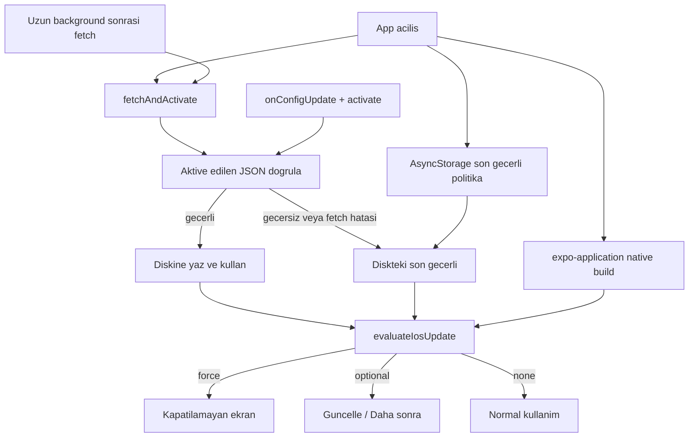

# iOS Remote Config sürüm kontrolü

## Mevcut durum

Native iOS Firebase kurulumu büyük ölçüde doğru ve **resmi** yoldan gelmiş:

- [`app.json`](app.json): `@react-native-firebase/app` + `ios.disableSPM: true`; `expo-build-properties` ile `useFrameworks: "static"` ve `forceStaticLinking: ["RNFBApp", "RNFBRemoteConfig"]`; `ios.googleServicesFile: "./GoogleService-Info.plist"`
- Özel `plugins/withReactNativeFirebase.js` **yok**; `app.json` / kaynak ağacında referans da yok. Ekstra temizlik gerekmez.
- Yerel `ios/` (gitignore’da) AppDelegate’de `FirebaseApp.configure()`, CocoaPods + `$RNFirebaseDisableSPM = true`. SPM ile karıştırmıyoruz; bu ayarlara dokunulmayacak.
- JS’te `@react-native-firebase/*` kullanımı yok. Kontrol tamamen yeni kod.
- Android Firebase dosyası / plugin’i yok. **Android’e google-services, plugin veya prebuild eklenmeyecek.**
- [`App.tsx`](App.tsx) tek kök: splash → login → sekmeler. Navigasyon yok. Kapı `Portal` içine, splash/`DetailModal` üstüne konacak.
- Tasarım: burgundy `#9F2F4D`, yüzey `#F7F6F2`, kart `rounded-[24px]`, CTA `rounded-[15px]`. Metinler Türkçe (login hariç).

RN Firebase **26** modular API zorunlu (`getRemoteConfig`, `fetchAndActivate`, `onConfigUpdate`). Namespaced `remoteConfig()` kullanılmayacak. v26 New Architecture ister; Expo 57 varsayılanı açıktır, `newArchEnabled: false` yok.

Remote Config paketinin peer’ı `@react-native-firebase/analytics`. **Analytics JS, event, kullanıcı/cihaz takibi eklenmeyecek.** Paket `package.json`’a yazılmayacak; yalnızca native peer yüzünden iOS link hatası çıkarsa o zaman peer kurulup `forceStaticLinking`’e `RNFBAnalytics` eklenir, JS’te import edilmez.

`prebuild --clean` varsayılan olarak çalıştırılmayacak. `expo-application` autolink ile mevcut `ios/` üzerinden alınır. `ios.buildNumber` değişince native senkron (aşağıda) zorunlu.

## Mimari

Gereksiz katman yok. Saf politika mantığı UI ve Firebase’den ayrı:



Yeni dosyalar:

- [`src/update/constants.ts`](src/update/constants.ts) — tek parametre adı ve test fetch aralığı
- [`src/update/iosUpdatePolicy.ts`](src/update/iosUpdatePolicy.ts) — tipler, parse, `evaluateIosUpdate` (RN import yok)
- [`src/update/lastValidPolicyStore.ts`](src/update/lastValidPolicyStore.ts) — yalnızca doğrulanmış politikanın kalıcı saklanması
- [`src/update/iosRemoteConfig.ts`](src/update/iosRemoteConfig.ts) — defaults, fetch/activate, değeri oku
- [`src/update/useIosUpdateGate.ts`](src/update/useIosUpdateGate.ts) — AppState + realtime + oturum içi optional bastırma
- [`src/update/ForceUpdateScreen.tsx`](src/update/ForceUpdateScreen.tsx)
- [`src/update/OptionalUpdateModal.tsx`](src/update/OptionalUpdateModal.tsx)
- [`scripts/verify-ios-update-policy.ts`](scripts/verify-ios-update-policy.ts) — kritik karar senaryoları

[`App.tsx`](App.tsx) yalnızca hook’u bağlar ve overlay’leri splash üstüne (`z-[60]`) basar.

## Sabitler — ortam mimarisi yok

```ts
export const IOS_UPDATE_POLICY_PARAM = "update_policy_ios_test";
export const REMOTE_CONFIG_MIN_FETCH_INTERVAL_MS = 0; // TestFlight testi; onbellek degisikligi gizlemesin
export const BACKGROUND_REFRESH_MS = 15 * 60 * 1000;
```

`__DEV__` veya `EXPO_PUBLIC_*` ile seçim **yapılmayacak**. App Store öncesi bu sabit `update_policy_ios_prod` olacak ve fetch aralığı ~12 saat yapılacak; **yeni native build şart**.

## Native sürüm ve buildNumber senkronu

`npx expo install expo-application` (SDK 57 uyumlu sürüm).

Kurulu uygulamadan (Expo [app versions](https://docs.expo.dev/build-reference/app-versions/) rehberi):

- `Application.nativeApplicationVersion` → native `CFBundleShortVersionString` (yalnızca gösterim)
- `Application.nativeBuildVersion` → native `CFBundleVersion`, tam sayıya parse

`package.json` / `app.json` / `Constants.expoConfig` **kurulu sürüm kabul edilmeyecek**. Build okunamazsa uygulama **engellenmez**, `__DEV__` log.

Karşılaştırma yalnız artan tam sayı `currentBuild` ile. Semver yok.

### Neden yalnız `app.json` + Xcode Archive yetmez

Projede yerel `ios/` var. Expo [CNG / prebuild](https://docs.expo.dev/workflow/continuous-native-generation/) ve [app versions](https://docs.expo.dev/build-reference/app-versions/) rehberine göre:

- `ios.buildNumber` → `CFBundleVersion`; `version` → `CFBundleShortVersionString`
- Mevcut native projede **kaynak native koddur**. `app.json` değişikliği, prebuild senkronu olmadan Info.plist / Xcode `CURRENT_PROJECT_VERSION` alanına gitmeyebilir.
- `npx expo run:ios` native klasör varken prebuild’i yeniden çalıştırmaz. Rehber, sonraki derlemelerde senkron için prebuild ister.
- Xcode Archive `app.json` okumaz; arşive o anki native `CFBundleVersion` girer.
- `expo-application` da arşivlenen binary’deki native değeri okur. Senkron atlanırsa 2. TestFlight build hâlâ `1` kalır; Remote Config karşılaştırması bozulur.

EAS remote version source **kurulmayacak** (`eas.json` yok; Xcode ile yükleme sürecek).

### Senkron adımı (`--clean` yok)

Her yeni iOS test/yayın build’inde, arşivden önce:

1. [`app.json`](app.json) içinde `expo.version` ve `ios.buildNumber` güncelle (ör. build `2`).
2. Yalnız iOS, mevcut native klasörü silmeden: `npx expo prebuild --platform ios`
3. Çıktıyı incele. Firebase `AppDelegate` / `GoogleService-Info.plist` / `$RNFirebaseDisableSPM` / static frameworks bozulmamalı. Android prebuild **çalıştırma**.
4. Native değerlerin `app.json` ile aynı olduğunu doğrula; değilse arşivleme.
   - `ios/BayraktarApp/Info.plist` → `CFBundleVersion`, `CFBundleShortVersionString`
   - `ios/BayraktarApp.xcodeproj/project.pbxproj` → `CURRENT_PROJECT_VERSION`, `MARKETING_VERSION` (şu an `MARKETING_VERSION` `1.0` / config `1.0.0` kayması var; senkron bunu da düzeltmeli)
5. `--clean` **ancak** prebuild version alanlarını yazmazsa ve inceleme Firebase native ayarlarını koruyacak şekilde gerekçelenirse. İlk tercih `--clean` değil.

### Arşivin gerçek build numarası

Xcode Archive sonrası, yüklemeden önce Organizer veya `.xcarchive` içindeki uygulama `Info.plist` değerlerini kontrol et:

- `CFBundleShortVersionString` = `app.json` `version`
- `CFBundleVersion` = `app.json` `ios.buildNumber`

TestFlight’a giden build bu sayıdır. Eşleşmezse yükleme; senkronu tekrarla.

Cihazda kurulum sonrası `__DEV__` log: `Application.nativeBuildVersion` arşivlenen `CFBundleVersion` ile aynı olmalı.

## Remote Config

Modular API, iOS’ta `useIosUpdateGate` mount olduğunda:

1. `defaultConfig` güvenli JSON: `enabled: false`, `optionalUpdateEnabled: false`, `forceUpdateEnabled: false`, boş `storeUrl`
2. `settings.minimumFetchIntervalMillis = 0`, `fetchTimeoutMillis` ~10s
3. `fetchAndActivate` — bu adım Firebase’in son aktive ettiği değeri günceller; **geçerli politika değildir**
4. `onConfigUpdate` → `activate` → yeniden değerlendir; unmount’ta unsubscribe
5. `AppState`: `background` zamanı kaydet; `active` ve süre ≥ 15 dk ise tekrar fetch. Ekran/tab değişiminde istek yok
6. `Platform.OS !== 'ios'` ise hook no-op; Android aynı kalır

### Son geçerli politika ≠ son aktive edilen Firebase değeri

Firebase activated cache hatalı JSON, boş string veya yarım şablon tutabilir. Bunu “son geçerli” sayma.

`npx expo install @react-native-async-storage/async-storage` ile ayrı kalıcı depo:

- Anahtar: `@bayraktar/ios-update-policy-last-valid`
- **Yalnızca** parse + alan doğrulaması geçen politika diske yazılır
- Hatalı JSON, fetch hatası, default/static boş değer **asla yazılmaz** ve diskteki kaydı ezmez
- Soğuk açılışta disk **Firebase okumasından önce** yüklenir; process belleği yetmez

Çözüm sırası her değerlendirmede:

1. Aktive edilen Remote Config string’ini parse et
2. Geçerliyse → diske yaz, bunu kullan
3. Geçersizse veya fetch/activate başarısızsa → diskteki son geçerliyi kullan (`__DEV__` log: `invalid_json_kept_last_valid` / `fetch_failed_kept_last_valid`)
4. Disk boş veya bozulmuşsa → güvenli default (`enabled: false`) → **blok yok**

Senaryo: geçerli politika kaydedildi → panelden hatalı JSON yayınlandı ve activate oldu → uygulama öldürülüp açıldı. Firebase activated hatalı kalır; kapı diskteki önceki geçerli politikayı kullanır.

## Politika doğrulama

JSON object; alanlar:

- `enabled`, `forceUpdateEnabled`, `optionalUpdateEnabled`: boolean
- `latestBuild`, `minimumSupportedBuild`: tam sayı (`Number.isInteger`, ≥ 1; `"1.0"` / float / NaN red)
- `minimumSupportedBuild <= latestBuild`
- `latestVersion`, `title`, `message`: string
- `storeUrl`: string; boş olabilir

Geçersiz politika **kilit üretmez**. Diskte son geçerli varsa o kullanılır; yoksa none. `__DEV__` gerekçe loglar: `invalid_json`, `invalid_build`, `min_gt_latest`, `unreadable_native_build`, `empty_store_url`, `invalid_store_url`, `invalid_json_kept_last_valid`, `fetch_failed_kept_last_valid`.

`storeUrl` doğrulama (uydurma link yok):

- Boş / parse edilemez / `http:` / `javascript:` → geçersiz
- İzin: `https:` (TestFlight veya App Store) ve gerekirse `itms-apps:` / `itms-beta:`

Geçersiz URL ile force/optional **gösterilmez** (kilit yok).

## Karar sırası

`evaluateIosUpdate(policy, currentBuild, storeUrlOk)`:

1. `!enabled` → `none`
2. `forceUpdateEnabled && currentBuild < minimumSupportedBuild` → URL geçerliyse `force`, değilse `none` + log
3. `optionalUpdateEnabled && currentBuild < latestBuild` → URL geçerliyse `optional`, değilse `none` + log
4. `currentBuild >= latestBuild` → `none`

Açılan store güncelleme sayılmaz. Yeni build kurulunca `currentBuild` yükselir, ekran kalkar.

İsteğe bağlı: aynı oturum + aynı `latestBuild` için “Daha sonra” sonrası tekrar yok (bellekte). Realtime ile `latestBuild` değişirse yeniden gösterilebilir.

## UI

**Zorunlu:** kapatılamayan tam ekran (splash üstü). Burgundy hero + beyaz kart. `title` / `message` (boşsa “Yeni sürüm hazır” / “Devam etmek için uygulamayı güncelle.”). `Güncelle` → `Linking.openURL` (önce `canOpenURL`). `Tekrar dene` → fetch + activate + yeniden değerlendir. Android back / `onRequestClose` yutulur. URL açılmasa da ekran kalır.

**İsteğe bağlı:** aynı dilde overlay popup: `Güncelle` + `Daha sonra`. System `Alert` kullanılmaz.

## Doğrulama

Saf fonksiyon senaryoları (`scripts/verify-ios-update-policy.ts` + `npm run typecheck`):

- `enabled: false` → none
- force + `currentBuild < minimumSupportedBuild` + geçerli URL → force
- force + geçersiz/boş URL → none
- optional + `currentBuild < latestBuild` → optional
- `currentBuild >= latestBuild` → none
- `minimumSupportedBuild > latestBuild` → invalid
- ondalık / negatif / string build → invalid
- geçersiz JSON → invalid; diske yazılmaz
- fetch hatası + diskte son geçerli force → force korunur
- fetch hatası + diskte kayıt yok → none
- geçerli kayıt sonrası hatalı JSON activate + soğuk açılış simülasyonu → diskteki geçerli kullanılır, Firebase activated yok sayılır

## Native / TestFlight — otomatik yükleme yok

iOS komutları:

```bash
npx expo install expo-application @react-native-async-storage/async-storage
npx expo prebuild --platform ios
# Info.plist + pbxproj build/version kontrolü; Firebase native ayarlarını incele
npx expo run:ios
npm run typecheck
node --experimental-strip-types --test scripts/verify-ios-update-policy.ts
```

Arşiv: native senkron ve `CFBundleVersion` doğrulandıktan sonra Xcode → `ios/BayraktarApp.xcworkspace` → Any iOS Device → Product → Archive. Organizer / `.xcarchive` içindeki `CFBundleVersion` `app.json` `ios.buildNumber` ile aynıysa Distribute → App Store Connect / TestFlight.

**Eksik:** `storeUrl` boş. TestFlight public link (`https://testflight.apple.com/join/...`) yok; uydurulmayacak. Kontrol açılmadan Firebase’de bu alan doldurulmalı.

### Test senaryosu

**1. build** (şimdiki `ios.buildNumber: "1"`, sürüm `1.0.0`): native `CFBundleVersion` `1` olduğunu doğrula, TestFlight’a yükle. Firebase’de `enabled: false` bırak → normal kullanım.

**2. build:** `app.json` → `ios.buildNumber: "2"` → `npx expo prebuild --platform ios` → Info.plist / pbxproj `2` → Archive → arşiv `CFBundleVersion` `2` → TestFlight. Test hesabından 2. build **indirilebilir** olana kadar force/optional açma.

**2. build indirilebilir olduktan sonra** Firebase `update_policy_ios_test`:

İsteğe bağlı (1. build yüklü cihazda):

- `enabled`: `true`
- `latestVersion`: `"1.0.0"`
- `latestBuild`: `2`
- `minimumSupportedBuild`: `1`
- `forceUpdateEnabled`: `false`
- `optionalUpdateEnabled`: `true`
- `storeUrl`: gerçek TestFlight linki
- `title` / `message`: istenen metin

Zorunlu (ayrı deneme, 1. build’de):

- `forceUpdateEnabled`: `true`
- `minimumSupportedBuild`: `2`
- `storeUrl`: aynı geçerli link

2. build’de `currentBuild >= latestBuild` → uyarı yok. 1. build’de “Güncelle” yalnızca store’u açar; ekran 2. build kurulunca kalkar. Panel değişince realtime + activate ile yeniden değerlendirilir.

### App Store yayın adımı (bu PR’da yapılmayacak)

1. [`src/update/constants.ts`](src/update/constants.ts) içinde `IOS_UPDATE_POLICY_PARAM` → `update_policy_ios_prod`
2. `REMOTE_CONFIG_MIN_FETCH_INTERVAL_MS` → `43200000` (12 saat); realtime dinleyici kalır
3. Firebase’de `update_policy_ios_prod` oluştur, `storeUrl`’i App Store linki yap
4. `ios.buildNumber` artır, `npx expo prebuild --platform ios`, native + arşiv `CFBundleVersion` doğrula, **yeni native build** al
5. JS-only OTA bu sabiti değiştirmez; native build şart

## Dışarıda bırakılanlar

Android güncelleme, Analytics/Firestore/push/backend, kullanıcı takibi, ortam mimarisi, EAS remote version source, TestFlight otomatik upload, varsayılan `prebuild --clean`, uydurma store URL.
